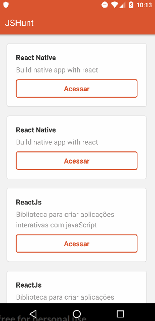

# JSHuntApp
Aplicativo desenvolvido em react native durante o curso starter da rocketseat, para listar alguns repositórios do git, a partir do consumo de uma API contendo informações de cada repositório.

## Executando o projeto

Primeiro é necessário ter um ambiente com todas as ferramentas necessárias para poder executar, e desenvolver um projeto react native, caso não tenha um ambiente configurado, esse [Link](https://docs.rocketseat.dev/ambiente-react-native/introducao) da rockeatseat de configuração irá ajudar. Com o ambiente configurado basta baixar o projeto, e logo depois acessar a pasta do projeto via terminal com `cd hunt`, e instalar todas as dependências do projeto utilizando o comando `npm install`.

Com as dependências instaladas, basta abir o emulador do android ou conectar um dispositivo android com depuração USB ativada, e executar o aplicativo utilizando o comando via terminal react-native run-android. Se tudo ocorrer bem, será possível visualizar a execução do aplicativo no dispositivo aberto.

  

## Meta
Emanuel Silva – emanuelborgesdasilva@gmail.com

Distribuído sob MIT License. Veja [LICENSE.md](LICENSE) para mais informações.

